# Marketo Mobile SDK for iOS 0.8.2

The Marketo Mobile SDK allows integration with Marketo Mobile Engagement (MME).  

Installation instructions and more are [here](http://developers.marketo.com/documentation/mobile/ "Marketo for Mobile").

Change Log

v0.8.2 (June 26, 2023)
- Added support for XCFramework to support multiple platforms.

v0.8.1 (June 05, 2023)
- Initialization param to include development framework type (viz., native, cordova, ionic or reactnative)
- Bug fixes & enhancements

v0.8.0 (March 06, 2023)
- Upgraded SDK minimum iOS version support to 12.0 & enhancements

v0.7.8 (August 19, 2021)
- Bug fixes & enhancements

v0.7.7 (March 6, 2020)
- Fixed unregister device token bug 

v0.7.6 (September 4, 2018)
 - Fixed tap gesture error at In-app

v0.7.5 (September 8, 2017)
- Fixed build errors and warnings in xCode 9

v0.7.4 (July 7, 2017)
- Exposed removeDevicePushToken() method

v0.7.1 (November 24, 2016)
- Handling notification in loadingOptions for iOS 10 to track tap activity when app is closed.

v0.7.0 (October 5, 2016)
- Using UNNotification to handle push received while app is in foreground with a local notification

v0.6.4 (August 23, 2016)
- Exposed method [MarketoSDK reportAll] to immediately send events

v0.6.3 (July 15, 2016)
- Support for InApp display frequency once.

v0.6.0 (June, 11 2016)
- InApp Notifications

v0.5.1 - v0.5.3
- Fixed new_install bug
- Fix for version bug

v0.5.0
- Advanced secure access
- Bitcode refactor
-

# Issues

If you encounter issues using or integrating this plugin, please file a support ticket at support.marketo.com

# Marketo iOS SDK Installation Guide

## Prerequisites

##### 1. Register an application in Marketo Admin portal, get your application secret key and munchkin id.

##### 2. Configure Android Push access learn here

##### 3. Configure iOS Push access learn [here](http://developers.marketo.com/documentation/mobile/ "Marketo for Mobile").

## Install Framework via cocoapods

## Expose removeDevicePushToken() method

##### 1. Install CocoaPods.

```Shell
sudo gem install cocoapods
```

##### 2. Change directory to your project directory and create a Podfile with smart defaults.

```Shell
pod init
```

##### 3. Open your Podfile.

```Shell
open -a Xcode Podfile
```

##### 4. Add the following line to your Podfile.

```Shell
pod 'Marketo-iOS-SDK'
```

##### 5. Save and close your Podfile.

##### 6. Download and install Marketo iOS SDK.

```Shell
pod install
```

##### 7. Open workspace in Xcode. open App.xcworkspace

# Setup Swift Bridging Header  
#####1. Go to File > New > File and Select Header File:
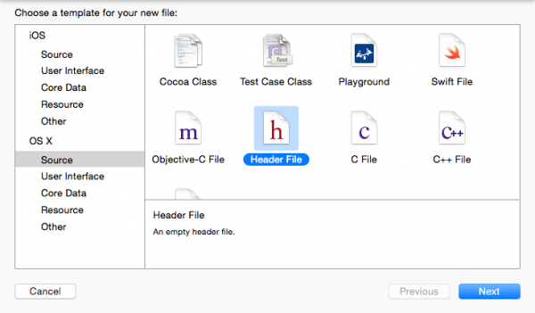

##### 2. Name the file <ProjectName>-Bridging-Header

##### 3. Go to Project->Target->Build Phases->Swift Compiler - Code Generation-> Add the following path to Objective-Bridging

#####Header: $(PODS_ROOT)/<ProjectName>-Bridging-Header.h
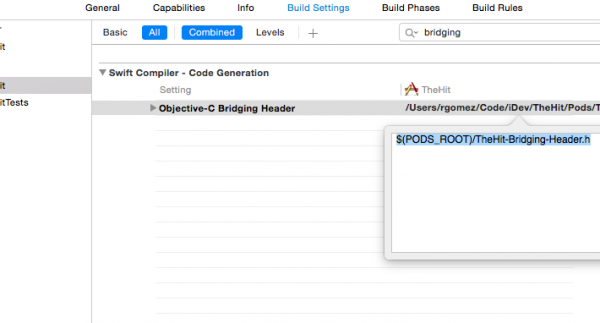

#SDK Initialization

##### Before you can use the Marketo iOS SDK, you must initialize it with your Munchkin Account Id and App Secret Key.  You can find each of these in the Marketo Admin area underneath Mobile Apps.

##### 1. Open your AppDelegate.m or Bridging file (Swift) and import the Marketo.h header file.

```Objective-C
import "Marketo.h"
```

##### 2. Paste the following code inside the application:didFinishLaunchingWithOptions: function.

###### Objective-C

```Objective-C
Marketo *sharedInstance = [Marketo sharedInstance];
[sharedInstance initializeWithMunchkinID:@"munchkinAccountId" appSecret:@"secretKey" mobileFrameworkType:@"native" launchOptions:launchOptions];

```

###### Swift

```Swift
let sharedInstance: Marketo = Marketo.sharedInstance()
sharedInstance.initializeWithMunchkinID("munchkinAccountId", appSecret: "secretKey", mobileFrameworkType: "native", launchOptions: launchOptions)
```

##### 3. Replace munkinAccountId and secretKey above using your Munchkin Account Id and Secret Key which are found in the Marketo Admin Mobile Apps section.
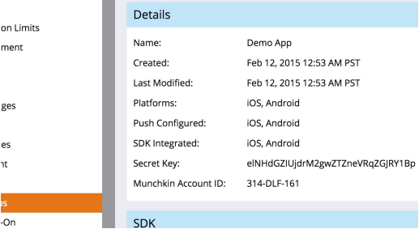

#Configure Push Notifications on Apple Developer Account

##### 1. Log into the Apple Developer Member Center.

##### 2. Click on “Certificates, Identifiers & Profiles”.

##### 3. Click on “Certificates->All” folder underneath “iOS, tvOS, watchOS”.

##### 4. Select the “+” the button on the top right of the screen.

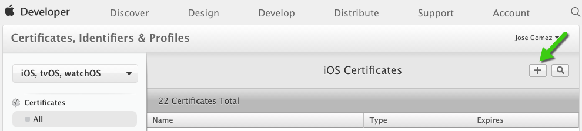

##### 5. Enable “Apple Push Notification service SSL (Sandbox & Production)” checkbox, and click “Continue”.

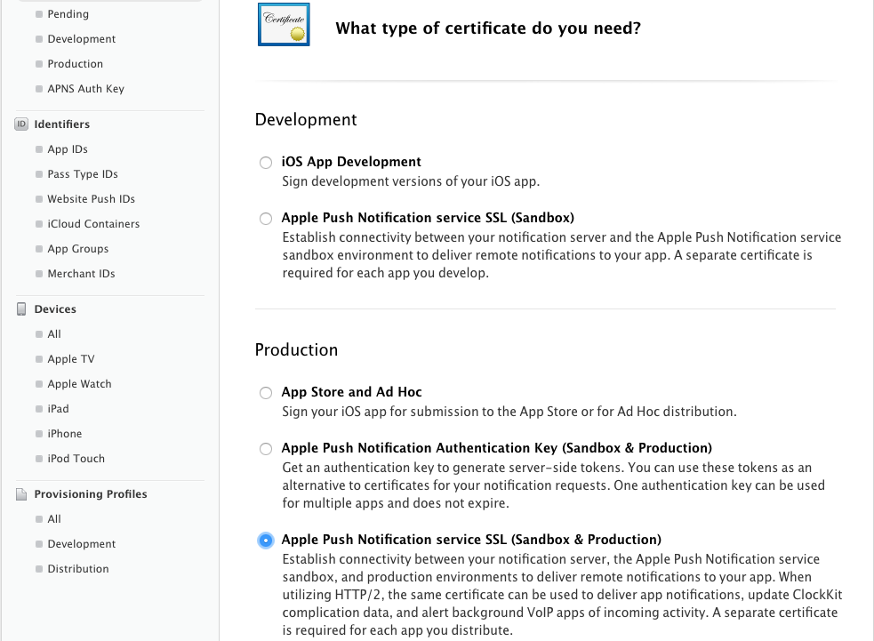

##### 6. Select the application identifier that you are using the build the app.

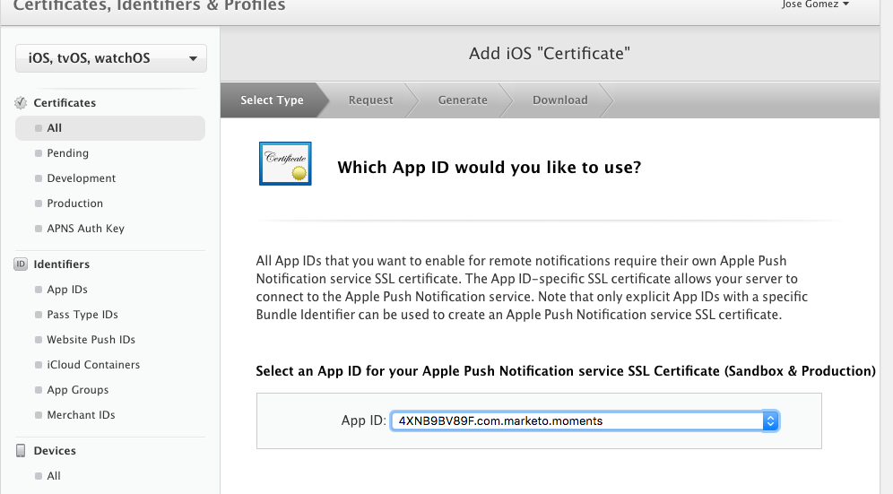

##### 7. Create and upload CSR to generate the push certificate.

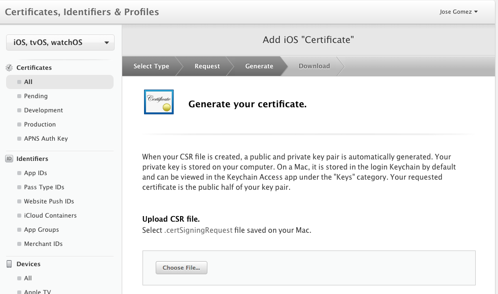

##### 8. Download certificate to local computer and double-click to install.

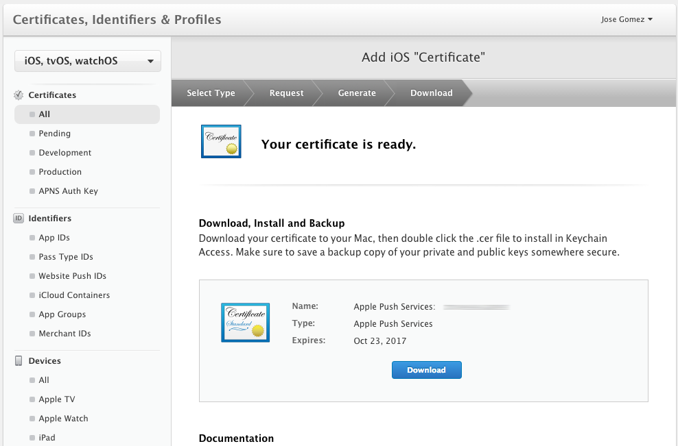

##### 9. Open “Keychain Access”, right click on the certificate, and export 2 items into .p12 file.

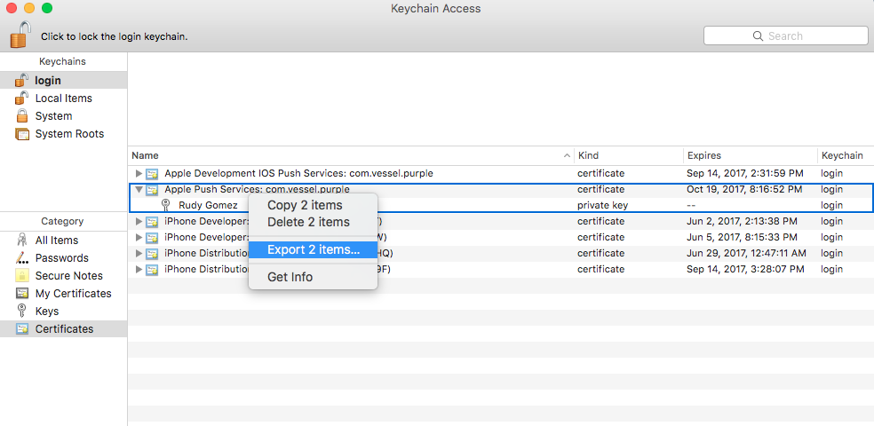

##### 10. Upload this file through Marketo Admin Console to configure notifications.

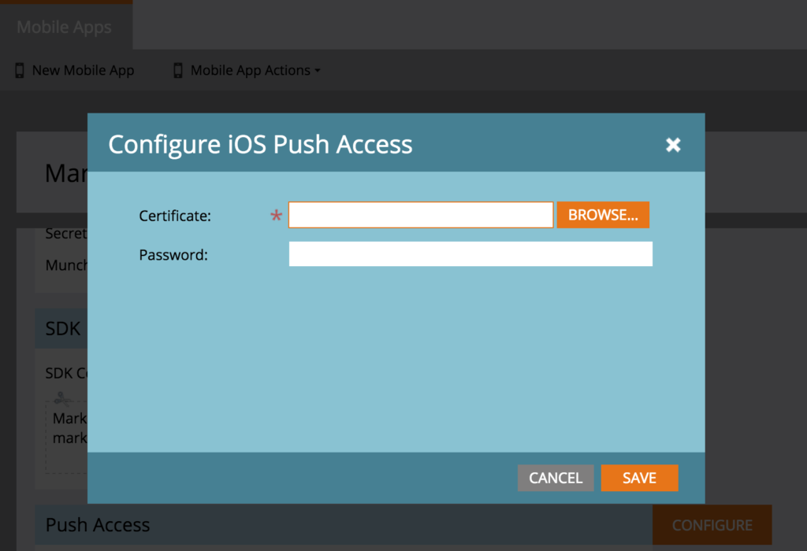

##### 11. Update app provisioning profiles.


#Enable Push Notifications in xCode

##### 1. Turn on push notification capability in xCode project.

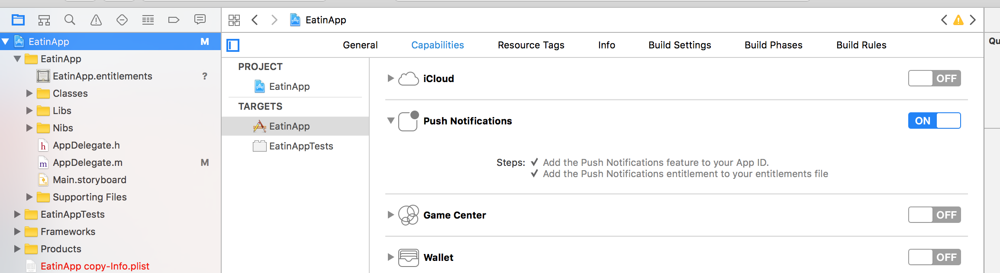


#Enable Push Notifications in App with Marketo SDK

##### 1. Import following in AppDelegate.h.

###### Objective-C

```Objective-C
#import <UserNotifications/UserNotifications.h>
```

###### Swift

```Swift
import UserNotifications
```

##### 2. Add UNUserNotificationCenterDelegate to AppDelegate as shown below.

###### Objective-C

```Objective-C
@interface AppDelegate : UIResponder <UIApplicationDelegate, UNUserNotificationCenterDelegate>
```

###### Swift

```Swift
class AppDelegate: UIResponder, UIApplicationDelegate , UNUserNotificationCenterDelegate
```

##### 3. Initiate Push notification Service : To enable push notification add below code.

###### Objective-C

```Objective-C
- (BOOL)application:(UIApplication *)application didFinishLaunchingWithOptions:(NSDictionary *)launchOptions{

    // ...

        UNUserNotificationCenter *center = [UNUserNotificationCenter currentNotificationCenter];
        center.delegate = self;
        [center requestAuthorizationWithOptions:(UNAuthorizationOptionSound | UNAuthorizationOptionAlert | UNAuthorizationOptionBadge) completionHandler:^(BOOL granted, NSError * _Nullable error){
            if(!error){
                dispatch_async(dispatch_get_main_queue(), ^{
                    [[UIApplication sharedApplication] registerForRemoteNotifications];
                });
            }
        }];

    // ...
}
```

###### Swift

```Swift
func application(_ application: UIApplication, didFinishLaunchingWithOptions launchOptions: [UIApplicationLaunchOptionsKey: Any]?) -> Bool {

    // ...

        UNUserNotificationCenter.current().requestAuthorization(options: [.alert, .sound, .badge]) { granted, error in
                if let error = error {
                    print("\(error.localizedDescription)")
                } else {
                    DispatchQueue.main.async {
                        application.registerForRemoteNotifications()
                    }
                }
            }

    // ...
}
```

##### 4. Register Push Token

###### Objective-C

```Objective-C
- (void)application:(UIApplication *)application didRegisterForRemoteNotificationsWithDeviceToken:(NSData *)deviceToken {
    // Register the push token with Marketo
    [[Marketo sharedInstance] registerPushDeviceToken:deviceToken];
}
```

###### Swift

```Swift
func application(_ application: UIApplication, didRegisterForRemoteNotificationsWithDeviceToken deviceToken: Data) {
    // Register the push token with Marketo
    Marketo.sharedInstance().registerPushDeviceToken(deviceToken)
}
```

###### The token can also be unregistered

###### Objective-C

```Objective-C
[[Marketo sharedInstance] unregisterPushDeviceToken];
```

###### Swift

```Swift
Marketo.sharedInstance().unregisterPushDeviceToken
```

##### 5. Add the following method in AppDelegate : By using this method you can either present alert, sound or increase badge while the app is in foreground. You must call completionHandler of your choice in this Method.

###### Objective-C

```Objective-C
- (void)userNotificationCenter:(UNUserNotificationCenter *)center
       willPresentNotification:(UNNotification *)notification
         withCompletionHandler:(void (^)(UNNotificationPresentationOptions options))completionHandler {
    NSLog(@"Notification is triggered");
      completionHandler(UNNotificationPresentationOptionAlert); // OR
    // completionHandler(UNNotificationPresentationOptionBadge); OR
    // completionHandler(UNNotificationPresentationOptionSound);
#endif
```

###### Swift

```Swift
func userNotificationCenter(_ center: UNUserNotificationCenter, willPresent notification: UNNotification, withCompletionHandler completionHandler: @escaping (UNNotificationPresentationOptions) -> Void) {
        completionHandler(.alert)  // OR
       // completionHandler(.badge) OR
        //completionHandler(.sound)
    }
```

##### 6. Handle newly received Push notification in AppDelegate : The method will be called on the delegate when the user responded to the notification by opening the application, dismissing the notification or choosing a UNNotificationAction. The delegate must be set before the application returns from applicationDidFinishLaunching:.

###### Objective-C

```Objective-C
- (void)userNotificationCenter:(UNUserNotificationCenter *)center
didReceiveNotificationResponse:(UNNotificationResponse *)response
         withCompletionHandler:(void(^)())completionHandler {
    [[Marketo sharedInstance] userNotificationCenter:center didReceiveNotificationResponse:response withCompletionHandler:completionHandler];
}
```

###### Swift

```Swift
func userNotificationCenter(_ center: UNUserNotificationCenter, didReceive response: UNNotificationResponse, withCompletionHandler completionHandler: @escaping () -> Void) {
    Marketo.sharedInstance().userNotificationCenter(center, didReceive: response, withCompletionHandler: completionHandler)
}
```

#iOS Test Devices

##### 1. Select Project->Target->Info->URL Types

##### 2. Add identifier: ${PRODUCT_NAME}

##### 3. Set URL Schemes: mkto-<seckey>

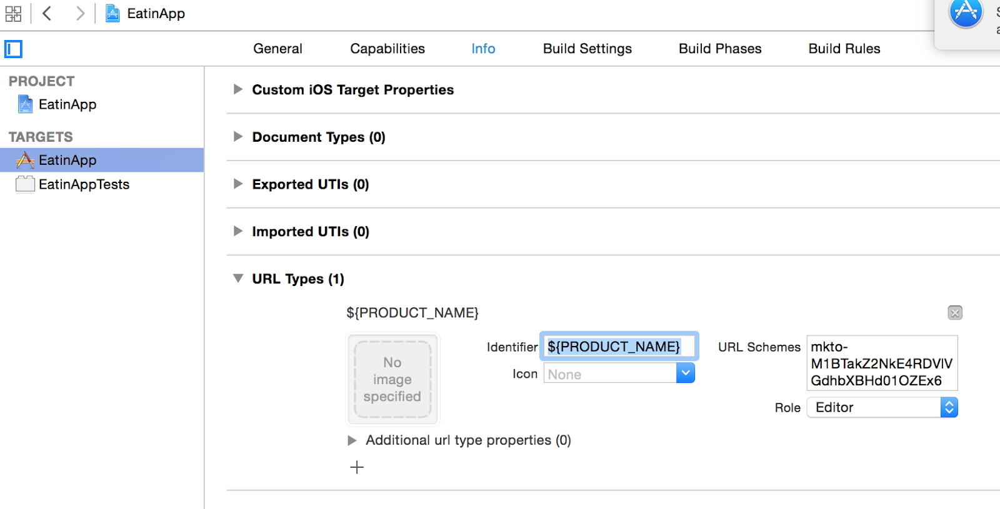

##### 5.Include application:openURL:sourceApplication:annotation: to AppDelegate.m

## Handle Custom Url Type in AppDelegate

###### Objective-C

```Objective-C
- (BOOL)application:(UIApplication *)app 
            openURL:(NSURL *)url 
            options:(NSDictionary<UIApplicationOpenURLOptionsKey,id> *)options{
            return [[Marketo sharedInstance] application:app
                                         openURL:url
                                         options:nil];
}
```

###### Swift

```Swift
private func application(_ app: UIApplication, open url: URL, options: [UIApplication.OpenURLOptionsKey : Any] = [:]) -> Bool
{
    return Marketo.sharedInstance().application(app, open: url, options: options)
}
```

#How to Create User Profiles on iOS

##### 1. Create User Profile

##### You can create rich profiles by sending user fields as shown below.

###### Objective-C

```Objective-C
MarketoLead *profile = [[MarketoLead alloc] init];

// Get user profile from network and populate
[profile setEmail:@"jd@makesomething.com"];
[profile setFirstName:@"John"];
[profile setLastName:@"Doe"];
[profile setAddress:@"1234KingFishSt"];
[profile setCity:@"SouthPadreIsland"];
[profile setState:@"CA"];
[profile setPostalCode:@"78596"];
[profile setCountry:@"USA"];
[profile setGender:@"male"];
[profile setLeadSource:@"_facebook_ads"];
[profile setBirthDay:@"01/01/1985"];
[profile setFacebookId:@"facebookid"];
[profile setFacebookProfileURL:@"facebook.com/profile"];
[profile setFacebookProfilePicURL:@"faceboook.com/profile/pic"];
[profile setLinkedInId:@"linkedinid"];
[profile setTwitterId:@"twitterid"];
```

###### Swift

```Swift
 let profile =  MarketoLead()
 // Get user profile from network and populate
 profile.setEmail("jd@makesomething.com")
 profile.setFirstName("John")
 profile.setLastName("Doe")
 profile.setAddress("1234KingFishSt")
 profile.setCity("SouthPadreIsland")
 profile.setState("CA")
 profile.setPostalCode("78596")
 profile.setCountry("USA")
 profile.setGender("male")
 profile.setLeadSource("_facebook_ads")
 profile.setBirthDay("01/01/1985")
 profile.setFacebookId("facebookid")
 profile.setFacebookProfileURL("facebook.com/profile")
 profile.setFacebookProfilePicURL("faceboook.com/profile/pic")
 profile.setLinkedInId("linkedinid")
 profile.setTwitterId("twitterid")
 ```

##### 2. Add more Standard Fields

###### Objective-C

```Objective-C
// Add other custom fields
[profile setFieldName:@"mobilePhone"withValue:@"123.456.7890"];
[profile setFieldName:@"numberOfEmployees"withValue:@"10"];
[profile setFieldName:@"phone"withValue:@"123.456.7890"];
```

###### Swift

```Swift
 profile.setFieldName("mobilePhone" , withValue :"123.456.7890");
 profile.setFieldName("numberOfEmployees", withValue: "10");
 profile.setFieldName("phone", withValue:"123.456.7890");
```

##### 3. Report User Profile

###### Objective-C

```Objective-C
Marketo *sharedInstance = [Marketo sharedInstance];

// This method will update user profile
[sharedInstance associateLead:profile];
```

###### Swift

```Swift
let marketo = Marketo.sharedInstance()

// This method will update user profile
marketo.associateLead(profile)
```

#How to Send Custom Actions on iOS

##### You can track user interactions by sending custom actions.

##### 1. Send custom action.

###### Objective-C

```Objective-C
Marketo *sharedInstance = [Marketo sharedInstance];

[sharedInstance reportAction:@"Login" withMetaData:nil];
```

##### 2. Add custom action meta data.

###### Objective-C

```Objective-C
MarketoActionMetaData *meta = [[MarketoActionMetaData alloc] init];
[meta setType:@"Shopping"];
[meta setDetails:@"RedShirt"];
[meta setLength:20];
[meta setMetric:30];

[sharedInstance reportAction:@"Bought Shirt" withMetaData:meta];
```

###### Swift

```Swift
let meta = MarketoActionMetaData()
meta.setType("Shopping");
meta.setDetails("RedShirt");
meta.setLength(20);
meta.setMetric(30);

sharedInstance.reportAction("Bought Shirt", withMetaData:meta);
```

# Advanced Security Access Mode

##### The Marketo SDK exposes methods to set and remove the security signature. There is also a utility method to retrieve the device ID. The device ID should be passed along with the email, upon login, to the customer server for use in calculating the security signature. The SDK should the hit new endpoint, pointing to algorithm listed above, to retrieve the necessary fields to instantiate the signature object. Setting this signature in the SDK is a necessary step if the Security Access Mode has been enabled in Marketo Mobile Admin. learn more about Advanced Security Access Mode [here](http://developers.marketo.com/documentation/mobile/advanced-security-access-mode/ "Marketo for Mobile").

###### Objective-C

```Objective-C

Marketo * sharedInstance =[Marketo sharedInstance];

// set secure signature
MKTSecuritySignature *signature =
[[MKTSecuritySignature alloc] initWithAccessKey:<ACCESS_KEY> signature:<SIGNATURE_TOKEN> timestamp:<EXPIRY_TIMESTAMP> email:<EMAIL>];
[sharedInstance setSecureSignature:signature];

[sharedInstance removeSecureSignature];

[sharedInstance getDeviceId];
```

###### Swift

```Swift
let sharedInstance = Marketo.sharedInstance()

 // set secure signature
let signature = MKTSecuritySignature(accessKey: <ACCESS_KEY>, signature: <SIGNATURE_TOKEN> , timestamp: <EXPIRY_TIMESTAMP>, email: <EMAIL>)
sharedInstance.setSecureSignature(signature)

[sharedInstance removeSecureSignature];

sharedInstance.getDeviceId()
```
